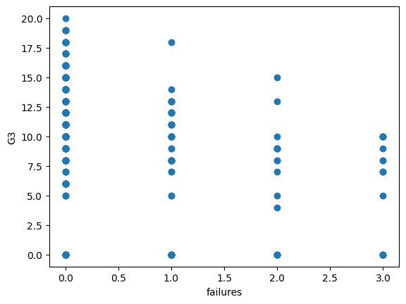

# Student Performance Predictor using Linear Regression

This project builds a **Linear Regression model** using `scikit-learn` to predict the final grade (`G3`) of students based on features like prior grades, study time, number of past class failures, and absences.


## Dataset

The dataset used is [`student-mat.csv`](https://archive.ics.uci.edu/ml/datasets/Student+Performance), which contains student data collected from two Portuguese schools.

A copy of the dataset file (`student-mat.csv`) is included in this repository for easy reproducibility.

### Selected Features:

- `G1`: Grade in first period
- `G2`: Grade in second period
- `studytime`: Weekly study time
- `failures`: Number of past class failures
- `absences`: Number of school absences
- `G3`: Final grade (target variable)

You can install the required libraries with:
```bash
pip install pandas numpy scikit-learn matplotlib
```


## Project Objective

To train a linear regression model that predicts a student's final grade (`G3`) based on the above features, and evaluate its accuracy using multiple random train-test splits.


## Libraries Used

- `pandas`
- `numpy`
- `matplotlib`
- `scikit-learn`
- `pickle` (for model persistence)


## How to Run
- Clone the repository or upload the notebook to Google Colab.

- Ensure the dataset ```student-mat.csv``` is present in the correct path.

- If needed, uncomment and run the training block to regenerate the model.

- Otherwise, proceed with predictions using the saved model files.


## How the Model Works

1. **Data Preprocessing:**
   - Loaded and cleaned using `pandas`.
   - Selected relevant features from the dataset.

2. **Training and Model Selection:**
   - Performed **30 iterations** of training with random `train_test_split`.
   - On each iteration, a `LinearRegression` model was trained and evaluated.
   - The **best model** (with highest accuracy) was saved using `pickle`.

3. **Saving the Model (One-time Setup):**
   This block of code was used to save the model once a good score was achieved (around 95.46%) and is now commented out:

   ```python
   """
   if score > best:
       best = score
       model_file = open("model.pickle", "wb")
       pickle.dump(model2, model_file)
       model_file.close()

       test_file = open("test_file.pickle", "wb")
       pickle.dump((x_test, y_test), test_file)
       test_file.close()
   print("______________________________________________________________")
   print(best * 100)
   """
 ## Visualization

The following scatter plot was generated to visualize the relationship between a selected feature (`failures`) and the final grade (`G3`):




# Author

Project by Sauharda-py.

Feel free to fork, star, and use for academic or learning purposes!

# License
This project is for educational purposes. Dataset © UCI Machine Learning Repository.
